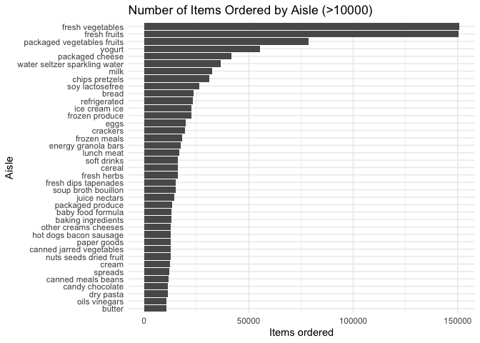
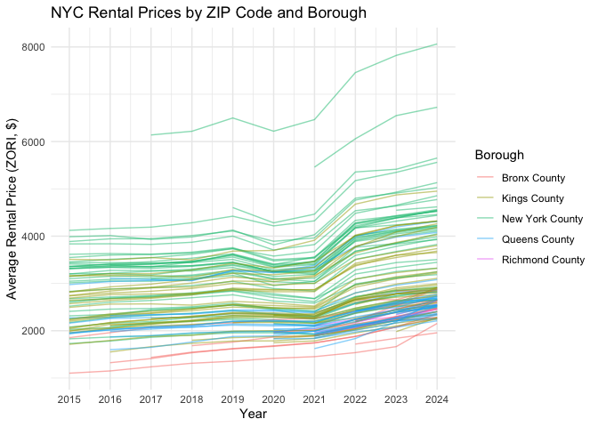
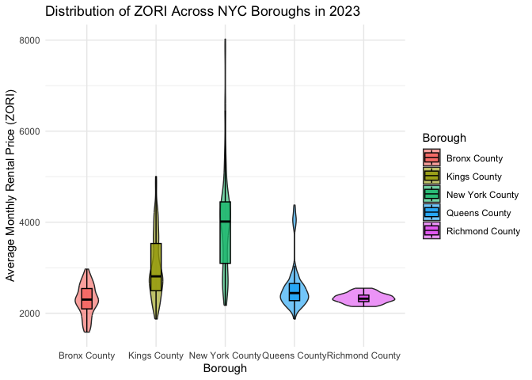
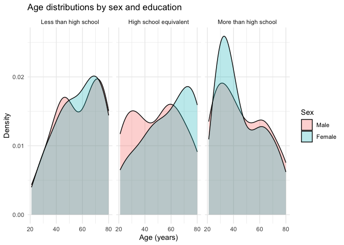
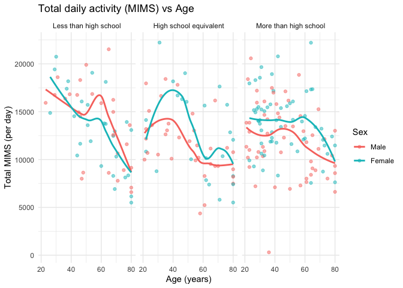
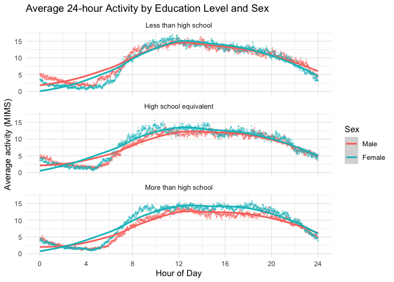

p8105_hw3_xl3054
================
Xinhui Lin (xl3054)
2025-10-13

# Problem 1

``` r
library(tidyverse)
```

    ## ── Attaching core tidyverse packages ──────────────────────── tidyverse 2.0.0 ──
    ## ✔ dplyr     1.1.4     ✔ readr     2.1.5
    ## ✔ forcats   1.0.0     ✔ stringr   1.5.1
    ## ✔ ggplot2   3.5.2     ✔ tibble    3.3.0
    ## ✔ lubridate 1.9.4     ✔ tidyr     1.3.1
    ## ✔ purrr     1.1.0     
    ## ── Conflicts ────────────────────────────────────────── tidyverse_conflicts() ──
    ## ✖ dplyr::filter() masks stats::filter()
    ## ✖ dplyr::lag()    masks stats::lag()
    ## ℹ Use the conflicted package (<http://conflicted.r-lib.org/>) to force all conflicts to become errors

``` r
library(p8105.datasets)
data("instacart")
```

The `instacart` dataset has 1384617 rows and 15 columns in total. The
columns include variables identifying the order, product, customer,
aisle, department, time of order, and indicating whether the product was
reordered. Within the 1384617 observations, there are 131209 unique
users.

``` r
## count by aisle
aisle_uniq = instacart %>% count(aisle, sort = TRUE)
```

There are 134 aisles. The aisle of fresh vegetables has the most items
ordered from.

``` r
## plot of number of items ordered in each aisle
instacart %>% count(aisle, name = "items_ordered") %>%  ## count by aisle
  filter(items_ordered > 10000) %>%  ## limit to aisle with 10000+ items ordered
  mutate(aisle = fct_reorder(aisle, items_ordered)) %>%  ## order aisles
  ggplot(aes(x = aisle, y = items_ordered)) + 
  geom_col() + 
  coord_flip() + ## horizontal to read better
  labs(title = "Number of Items Ordered by Aisle (>10000)",
       x = "Aisle",
       y = "Items ordered") +
  theme_minimal()
```

<!-- -->

``` r
## table of top 3 popular items in 3 aisles
instacart %>% filter(aisle %in% 
                       c("baking ingredients", 
                         "dog food care", 
                         "packaged vegetables fruits")) %>%  ## choose aisles
  count(aisle, product_name, sort = TRUE) %>%  ## count by aisles and products
  group_by(aisle) %>% 
  slice_max(n, n = 3) %>%  ## top 3 in each
  arrange(aisle, desc(n))
```

    ## # A tibble: 9 × 3
    ## # Groups:   aisle [3]
    ##   aisle                      product_name                                      n
    ##   <chr>                      <chr>                                         <int>
    ## 1 baking ingredients         Light Brown Sugar                               499
    ## 2 baking ingredients         Pure Baking Soda                                387
    ## 3 baking ingredients         Cane Sugar                                      336
    ## 4 dog food care              Snack Sticks Chicken & Rice Recipe Dog Treats    30
    ## 5 dog food care              Organix Chicken & Brown Rice Recipe              28
    ## 6 dog food care              Small Dog Biscuits                               26
    ## 7 packaged vegetables fruits Organic Baby Spinach                           9784
    ## 8 packaged vegetables fruits Organic Raspberries                            5546
    ## 9 packaged vegetables fruits Organic Blueberries                            4966

``` r
## table of mean hour of the day that two of the products are ordered
instacart %>% filter(product_name %in% c("Pink Lady Apples", "Coffee Ice Cream")) %>%  ## select products
  group_by(product_name, order_dow) %>%  
  summarise(mean_hour = mean(order_hour_of_day), .groups = "drop") %>%  ## calculate mean hour
  mutate(order_dow = recode(order_dow,
                            `0` = "Sunday",
                            `1` = "Monday",
                            `2` = "Tuesday",
                            `3` = "Wednesday",
                            `4` = "Thursday",
                            `5` = "Friday",
                            `6` = "Saturday")) %>%  ## change name of days of week
  pivot_wider(names_from = order_dow,
              values_from = mean_hour) %>%  ## pivot wider with days as columns
  column_to_rownames("product_name")  ## make products as rows
```

    ##                    Sunday   Monday  Tuesday Wednesday Thursday   Friday
    ## Coffee Ice Cream 13.77419 14.31579 15.38095  15.31818 15.21739 12.26316
    ## Pink Lady Apples 13.44118 11.36000 11.70213  14.25000 11.55172 12.78431
    ##                  Saturday
    ## Coffee Ice Cream 13.83333
    ## Pink Lady Apples 11.93750

# Problem 2

``` r
## zipcode
zip_codes = read_csv(file = "./Data/Zip Codes.csv") %>%  ## load data
  janitor::clean_names() %>%  ## clean data
  select(zip_code, county, neighborhood, county_fips) %>%  ## select related columns
  slice(-c(226, 227)) ## remove repeated zipcodes
```

    ## Rows: 322 Columns: 7
    ## ── Column specification ────────────────────────────────────────────────────────
    ## Delimiter: ","
    ## chr (4): County, County Code, File Date, Neighborhood
    ## dbl (3): State FIPS, County FIPS, ZipCode
    ## 
    ## ℹ Use `spec()` to retrieve the full column specification for this data.
    ## ℹ Specify the column types or set `show_col_types = FALSE` to quiet this message.

``` r
## zori
zori = read_csv(file = "./Data/Zip_zori_uc_sfrcondomfr_sm_month_NYC.csv") %>%  ## load data
  janitor::clean_names() %>%  ## clean data
  pivot_longer(cols = starts_with("x"), 
    names_to = "date",
    values_to = "zori") %>%  ## pivot longer by dats
  mutate(date = str_remove(date, "^x")) %>%  ## clean date format
  separate(date, into = c("year", "month", "day"), sep = "_") %>%  ## separate into year, month, day
  mutate(year = as.integer(year), 
    month = month.name[as.integer(month)]) %>%
  select(-c(state))  ## make year into integer, month as full name, remove state (repeated)
```

    ## Rows: 149 Columns: 125
    ## ── Column specification ────────────────────────────────────────────────────────
    ## Delimiter: ","
    ## chr   (6): RegionType, StateName, State, City, Metro, CountyName
    ## dbl (119): RegionID, SizeRank, RegionName, 2015-01-31, 2015-02-28, 2015-03-3...
    ## 
    ## ℹ Use `spec()` to retrieve the full column specification for this data.
    ## ℹ Specify the column types or set `show_col_types = FALSE` to quiet this message.

``` r
## merging
combined = right_join(zip_codes, zori, by = c("zip_code" = "region_name")) %>%
  select(year, month, ## time
         zip_code, county_fips, region_id,  ## ids
         state_name, city, county_name, region_type, neighborhood, metro, size_rank,  ## geographic
         zori) ## metric
```

``` r
## observed 116 times
obs_116 = combined %>% filter(!is.na(zori)) %>% 
  count(zip_code, sort = TRUE) %>% filter(n==116)
```

48 ZIP codes are observed 116 times.

``` r
## observed < 10 times
obs_10 = combined %>% filter(!is.na(zori)) %>% 
  count(zip_code, sort = TRUE) %>% filter(n<10)
```

26 ZIP codes are observed fewer than 10 times.

Zillow tends to collect rental price data more frequently in areas with
high rental market activity, and less frequently collects data in areas
with limited or less visible rental activity. For example, 10044 is
Roosevelt Island, which is a small and isolated island that have very
limited number of rental listings and most buildings have long-term
tenants, so Zillow would not frequently collect data in that area. 11370
is the area near LaGuardia Airport and mix of residential and industrial
zoning, where many landlords rent directly, not through online platforms
like Zillow.

``` r
## table of average rental price by borough and year
combined %>%
  group_by(county_name, year) %>%  ## by year and borough
  summarize(mean_zori = mean(zori, na.rm = TRUE), .groups = "drop") %>%  ## find mean
  arrange(county_name, year) %>%  ## order
  mutate(mean_zori = round(mean_zori, 2)) %>%
  pivot_wider(names_from = year, values_from = mean_zori) %>%  ## pivot wider
  column_to_rownames("county_name")  ## make borough names as rownames
```

    ##                    2015    2016    2017    2018    2019    2020    2021    2022
    ## Bronx County    1759.60 1520.19 1543.60 1639.43 1705.59 1811.44 1857.78 2054.27
    ## Kings County    2492.93 2520.36 2545.83 2547.29 2630.50 2555.05 2549.89 2868.20
    ## New York County 3022.04 3038.82 3133.85 3183.70 3310.41 3106.52 3136.63 3778.37
    ## Queens County   2214.71 2271.96 2263.30 2291.92 2387.82 2315.63 2210.79 2406.04
    ## Richmond County     NaN     NaN     NaN     NaN     NaN 1977.61 2045.43 2147.44
    ##                    2023    2024
    ## Bronx County    2285.46 2496.90
    ## Kings County    3015.18 3126.80
    ## New York County 3932.61 4078.44
    ## Queens County   2561.62 2694.02
    ## Richmond County 2332.93 2536.44

Overall, from 2015 to 2023, the average rental prices increased across
all NYC boroughs. Especially, there is a sharp rise in average rental
prices from 2021 to 2022. Manhattan consistently had the highest rents
across all years, followed by Kings and Queens. There is a small drop in
average rental prices from 2019 to 2020, which reflects the COVID-19
pandemic impact on housing and rental demands, followed by a strong
rebound as the market recovered.

``` r
## plot of rental price within zipcodes for all years
zori_all = combined %>%
  filter(!is.na(county_name), !is.na(year), !is.na(zori)) %>%  ## filter out NA rows
  group_by(county_name, year, zip_code) %>%
  summarize(mean_zori = mean(zori, na.rm = TRUE), .groups = "drop") %>% 
  ggplot(aes(x = year, y = mean_zori, group = zip_code, color = county_name)) + 
  geom_line(alpha = 0.5) +
  theme_minimal() + 
  scale_x_continuous(breaks = seq(from = min(pull(combined, year), na.rm = TRUE),  
                                  to = max(pull(combined, year), na.rm = TRUE),
                                  by = 1)) +  ## fix x-axis year labels
  labs(title = "NYC Rental Prices by ZIP Code and Borough",
       x = "Year",
       y = "Average Rental Price (ZORI, $)",
       color = "Borough")
zori_all
```

<!-- -->

This plot shows a clear upward trend in NYC rental prices across all
boroughs from 2015 to 2024. There is an obvious drop from 2019 to 2020,
followed by a sharp increase from 2021 to 2022, which reflects the
rental market during and after the COVID-19 pandemic. Most boroughs of
Manhattan have the highest average rental prices and the steepest
increase after the pandemic, compared to Bronx boroughs remains to be
the areas with lowest rental prices with the most steady increase.

``` r
## average rental price in 2023
zori_2023 = combined %>%
  filter(year == 2023, !is.na(county_name), !is.na(month), !is.na(zori)) %>%  ## remove NA rows
  group_by(county_name, zip_code, month) %>%
  summarize(mean_zori = mean(zori, na.rm = TRUE), .groups = "drop") %>% 
  ggplot(aes(x = county_name, y = mean_zori, fill = county_name)) +
  geom_violin(trim = TRUE, alpha = 0.6) +  ## showing distribution
  geom_boxplot(width = 0.15, outlier.shape = NA, alpha = 0.8, color = "black") +
  theme_minimal() +
  labs(title = "Distribution of ZORI Across NYC Boroughs in 2023",
       x = "Borough",
       y = "Average Monthly Rental Price (ZORI)",
       fill = "Borough")
zori_2023
```

<!-- -->

This plot shows the difference in distribution in 2023 rental prices
across NYC boroughs. Manhattan has the highest median and maximum rents
with the widest range, indicating both higher rental prices and greater
variability and showing Manhattan as the most expansive borough. Kings
County has the second high median and max rents with also a relative
wide spread. Richmond County has the smallest variation in prices,
suggesting a relatively uniform rental market.

``` r
## combine two plots and export
library(patchwork)
combined_zori = zori_all/zori_2023
ggsave("results/Combined ZORI.png", combined_zori, width = 10, height = 8, dpi = 200)
```

# Problem 3

``` r
library(httr)
demographic = read_csv("https://p8105.com/data/nhanes_covar.csv", skip = 4)
```

    ## Rows: 250 Columns: 5
    ## ── Column specification ────────────────────────────────────────────────────────
    ## Delimiter: ","
    ## dbl (5): SEQN, sex, age, BMI, education
    ## 
    ## ℹ Use `spec()` to retrieve the full column specification for this data.
    ## ℹ Specify the column types or set `show_col_types = FALSE` to quiet this message.

``` r
accelerometer = read_csv("https://p8105.com/data/nhanes_accel.csv")
```

    ## Rows: 250 Columns: 1441
    ## ── Column specification ────────────────────────────────────────────────────────
    ## Delimiter: ","
    ## dbl (1441): SEQN, min1, min2, min3, min4, min5, min6, min7, min8, min9, min1...
    ## 
    ## ℹ Use `spec()` to retrieve the full column specification for this data.
    ## ℹ Specify the column types or set `show_col_types = FALSE` to quiet this message.

``` r
acc_merged = left_join(demographic, accelerometer, by = "SEQN")

acc_merged = acc_merged %>%
  janitor::clean_names() %>% 
  filter(age>=21) %>% 
  drop_na(sex, age, bmi, education) %>%   ## remove missing data
  mutate(sex = case_when(
      sex == "1" ~ "Male",
      sex == "2" ~ "Female"), ## encode sex
    sex = factor(sex, levels = c("Male", "Female")),
    education = case_when(
      education == "1" ~ "Less than high school",
      education == "2" ~ "High school equivalent", 
      education == "3" ~ "More than high school"), ## encode education
    education = factor(education, levels = c("Less than high school", 
                                             "High school equivalent", 
                                             "More than high school")))
```

``` r
## table of number of men and women by education levels
acc_merged  %>% 
  count(education, sex, name = "n") %>% 
  pivot_wider(names_from = sex, values_from = n) %>% 
  column_to_rownames("education")
```

    ##                        Male Female
    ## Less than high school    27     28
    ## High school equivalent   35     23
    ## More than high school    56     59

This table shows the number of males and females by three education
levels. Most participants (56 males and 59 females) have more than a
high school education. There are much fewer females (23) in high school
equivalent level than males (35). Overall, the total number of males and
females are similar (118 males and 110 females), indicating there would
not be a major gender imbalance, although this sample may not fully
represent general population.

``` r
## plot of age distribution
acc_merged %>% ggplot(aes(x = age, fill = sex)) + 
  geom_density(alpha = 0.3) + 
  facet_wrap(~ education, nrow = 1) +  ## make plots by education
  theme_minimal() + 
  labs(
    title = "Age distributions by sex and education", 
    x = "Age (years)", 
    y = "Density", 
    fill = "Sex"
  )
```

<!-- -->

This plot shows the age distribution of participants by sex and
different education levels. Among those with less than high school
education, the age patterns seem similar between males and females; both
males and females tend to be older. Within the high school equivalent
group, there are more older females than males, and more males around 30
and 60 years old. In the more than high school group, there are much
more younger people, around 20-40 years old, particularly among females.
This shows that higher education levels in this sample are more common
among younger participants (20-40 years old), while lower education
levels are more common among older participants.

``` r
## plot of total daily activity 
acc_merged %>% 
  pivot_longer(
    cols = matches("^min", ignore.case = TRUE),
    names_to = "minute_var",
    values_to = "mims") %>% 
  group_by(seqn) %>% 
  summarise(total_mims = sum(mims),
            .groups = "drop") %>% 
  left_join(acc_merged[,1:5], by = "seqn") %>%   ## group by participant
  ggplot(aes(x = age, y = total_mims, color = sex)) + 
  geom_point(alpha = 0.5) + 
  geom_smooth(method ="loess", se = FALSE) +  ## add smooth line
  facet_wrap(~ education) +  ## by education level
  theme_minimal() +
  labs(title = "Total daily activity (MIMS) vs Age",
       x = "Age (years)",
       y = "Total MIMS (per day)",
       color = "Sex")
```

    ## `geom_smooth()` using formula = 'y ~ x'

<!-- -->

This plot shows how total daily activity varies by age and sex. Across
all education levels, total activity tends to decline as age increases,
reflecting a decreased amount of physical movement in older adults. For
participants with less than high school, activity decreases sharply
after around age 60 for both males and females. In the high school
equivalent group, both sexes show a activity peak around age 40,
followed by a similar downward trend. In the more than high school
group, the trends between males and females are similar, with females
have a greater total activity than males across all ages. In general,
females generally maintain higher acitivity than males, especially in
higher education groups.

``` r
## plot of activity over 24 hour
acc_merged %>% 
  pivot_longer(
    cols = matches("^min", ignore.case = TRUE),
    names_to = "minute_var",
    values_to = "mims") %>% 
  mutate(minute = as.integer(str_remove(minute_var, "^min")),
         hour = minute / 60) %>%  ## change minutes to hours
  group_by(education, sex, hour) %>% 
  summarize(mean_mims = mean(mims, na.rm = TRUE), .groups = "drop") %>% 
  ggplot(aes(x = hour, y = mean_mims, color = sex)) + 
  geom_point(size = 0.3, alpha = 0.3)+
  geom_smooth(method = "loess") +  ## smooth line with loess
  facet_wrap(~ education, ncol = 1) +  ## by education levels
  scale_x_continuous(limits = c(0, 24), breaks = seq(0, 24, 4)) + 
  labs(x = "Hour of Day",
       y = "Average activity (MIMS)",
       title = "Average 24-hour Activity by Education Level and Sex",
       color = "Sex") +
  theme_minimal()
```

    ## `geom_smooth()` using formula = 'y ~ x'

<!-- -->

This plot shows the 24-hour activity patterns across education levels
and sex. In all groups, activity is lowest during the early morning
hourse, around 5AM, and rises sharply after that. The peak time for
activity is around noon to early afternoon, and activity decreases into
the evening. People with less than high school education show a slightly
higher activity during the day. In the high school equivalent group,
males and females have very similar activity amount, with females have
slightly higher activity. In the more than high school group,
participants maintain more moderate but consistent activity from morning
to early evening. Differences between males and females are very small
in all three groups.
